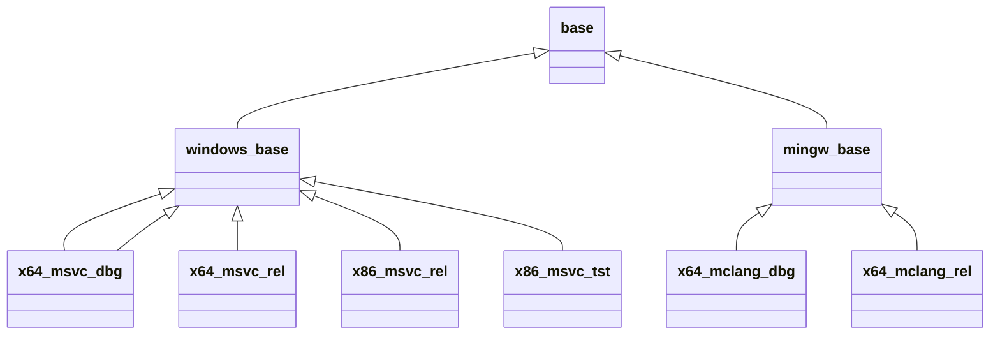

# Code CMake VCPkg

An MVP repo to compile C++ and run the tests using CMake, Ninja, VCPkg & GitHub actions.

## CMake Docs
* https://cmake.org/cmake/help/latest/index.html

## Ninja Docs
* https://ninja-build.org/manual.html

## VCPkg Docs
* https://vcpkg.io/en/index.html

## GitHub Actions Docs
* https://docs.github.com/en/actions
* https://github.com/marketplace?type=actions
* https://github.com/orgs/actions/repositories?q=&type=all&language=&sort=name
* https://github.com/actions/runner-images/blob/main/images/win/Windows2022-Readme.md

## CMake Presets

end of graph
